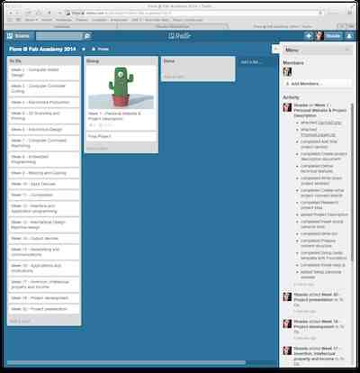
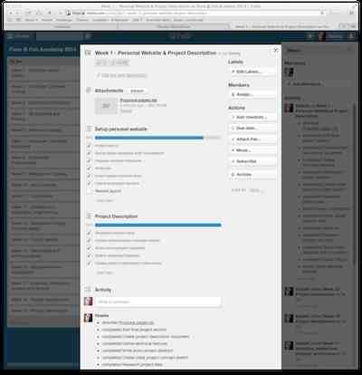

<ul class="breadcrumbs">
	<li><a href="../index.html">Home</a></li>
	<li><a href="./index.html">Classes</a></li>
    <li>Week 1</li>
</ul>

# Principles and practices, Project management

###Introduction

The goal of this class is to setup a personal website, learn about project management processes and tools, and describe the
final project.

Thanks to my previous experience I already used most of the tools presented to produce web content, manage distributed 
development and projects.

All the tools presented are well known and stable software, each with their own plus and minuses. While it could be interesting
to discuss the differences among them, I feel it could be more useful to experiment with different emerging solutions with similar
characteristics.  

For this reason, after defining my project concept, I have also focused on trying some recent open-source tools which could be useful in all of these areas.

###About this site

This site was generated using the [HarpJS](http://harpjs.com) software running on [Node.js](http://nodejs.com), and statically compiled to be hosted on the FabAcademy servers.

The HarpJS project was born as a static files webserver, with the added capability of dynamically compiling most of the common file formats used
for modern web development such as LESS, SASS for generating CSS and Markdown, EJS, Jade for generating HTML.

This allows to quickly prototype websites, without having to code complex asset management scripts and including external dependencies.

As already mentioned it is also possible to use HarpJS to generate a static website out of the source code, thus allowing to host
the web content on any server. This makes HarpJS more powerful than other similar systems such as [Jakyll](http://jekyllrb.com), [Octopress](http://octopress.org) and [Pelican](http://getpelican.com) which I'm using for other projects.

For an example of how you can create a site with HarpJS you can take a look to my [github repository](http://github.com/fibasile/fabacademy2014),
where I'll be hosting the source of this site, in the provided README you will find all instructions to build it. 

A great introduction to HarpJS is available [here](http://harpjs.com/docs/). 

Concerning the site looks, the page template uses the [Foundation 5](http://foundation.zurb.com) framework, providing an easy and terse formatting for web content. Most of the content is written in [Markdown](http://daringfireball.net/projects/markdown/) using [Textmate](http://www.macromates.com), my favourite text editor. 

Markdown content is great because it looks like text content while providing a convenient set of conversion tools for generating many formats.

For an example of markdown synthax check this page [source](https://raw.github.com/fibasile/fabacademy2014/master/public/classes/01_principles_project.md).

One other intersting tool I suggest for processing Markdown content is [Pandoc](http://johnmacfarlane.net/pandoc/), which allows to convert content from many input to many output formats, in some way very similar to what ImageMagick does for images.

Talking about images, one tool I strongly recommend for reducing PNG and GIF image size is [optipng](http://optipng.sourceforge.net) which I plan
to use to slim my images down when needed. 

As an example, the Fab Lab Cascina image contained in the homepage, already optimized by Photoshop when scaled down, got an 17% decrease in size with optipng:

	> optipng logo_fablab_s.png 
	** Processing: logo_fablab_s.png
	150x57 pixels, 4x8 bits/pixel, RGB+alpha
	Input IDAT size = 15984 bytes
	Input file size = 19268 bytes

	Trying:
	  zc = 9  zm = 8  zs = 0  f = 0		IDAT size = 12578
                               
	Selecting parameters:
	  zc = 9  zm = 8  zs = 0  f = 0		IDAT size = 12578

	Output IDAT size = 12578 bytes (3406 bytes decrease)
	Output file size = 15862 bytes (3406 bytes = 17.68% decrease)

### About project management

I'm used to develop software for a living, so project management has always been a foundamental part of my job. When managing
large projects I used very often Gantt charts created using several different tools, from Excel to MS Project to many php scripts and so on.

I personally find it difficult to match the spiral development approach with a strict project management loop such as that dictated by a gantt chart alone. For this reason I will be trying to organize my lab activities and the final project using several tools, but I also plan to investigate further if there's space for adopting some of the existing "agile" software development practices on hardware projects, especially
considering possible differences between the two.

I will manage the projects using the [Trello](http://trello.com) platform, which will also be useful for shared projects with other students at the Beach Lab. For every project I will keep a series of *stories* each describing one desired functionality and linking reference material.
The overall progress will be defined by a checklist, where I will assign myself deadlines for keeping up with assignment schedule.

The material contained in the Trello projects will be used to produce the assignment documentation during each week. 

<ul class="small-block-grid-2">
   <li></li>
   <li></li>
</ul> 

Additionally, for the final project, I plan to keep an [activity log](../project/log.html), which will help me monitor the progress done during the development, and an overall [schedule](../project/gantt.html) where I will keep important milestones stating the major project phases and link results achieved so far, taking into account that I will probably work on several milestones in parallel.

Finally, as more material is collected for the project, and especially for the software and hardware documentation which it requires, I plan
to setup a wiki using [TiddlyWiki](http://tiddlywiki.com), also recommended during the class, which will play nicely with the HarpJS setup
I described above.

### About the final project

My final project concept is a Digital Companion device and API, aimed at creating a new generation of human computer interfaces that can be fabricated with the Fab Lab tools and easily programmed and controlled in Python from any computer.

You can find a complete description of the concept in the [Final Project Description](../project/description.html) page.

