<ul class="breadcrumbs">
	<li><a href="../index.html">Home</a></li>
	<li><a href="./index.html">Classes</a></li>
    <li>Week 2</li>
</ul>

#Computer-aided design

###Introduction

During this week we are asked to explore the different software packages presented for 2D and 3D modeling. These should be used to create sketches for our final project.

I used several of the proposed packages with the objective of creating the case of my digital companion project and some tool that will be useful as the project progresses.

###2D sketching and drawing

During the previous week I had already sketched using a pen-drawing tool, [Penultimate](http://evernote.com/intl/it/penultimate/) some basic concept art. While this is far from realistic it gives an idea of the features I would like to have implemented. And the tool itself makes a great replacement for a paper notebook when doing concept art.

I then used Inkscape to create a vector drawing of it, which can be used for the user manual to illustrate the different features. It turned out that a simplification of this works also great as a logo of my project.

<ul class="small-block-grid-2">
   <li><a class="th">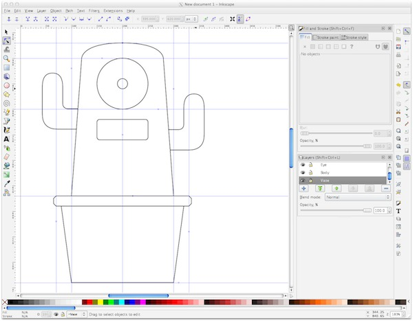</a></li>
   <li></li>
</ul>

Aside from that I concentrated my time on using and understanding [Inkscape](http://inkscape.org) with a specific focus on using it as a tool to allow users of my project to add new facial expressions to the system.

###An Inkscape extension

The display I plan to use for the project has only a two color screen, and images can be loaded into it as a bitmap of 128x64, represented as an array of bytes. This is good for the low memory usage of the microcontroller, but it makes quite difficult to create such images, especially from a non technical person.

    <a class="th">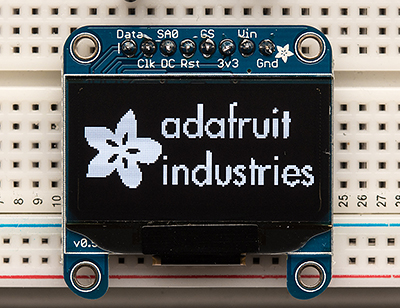</a>
     A 128x64 OLED screen

For this reason I created an Inkscape extension, that allows to make these images in a very intuitive way. An extension is a python script, accompanied by an xml manifest, which adds a new menu entry to Inkscape calling a custom function.

Each extension, when invoked via the GUI, can access the SVG document and manipulate it at will, outputting a modified document as a result.

<ul class="small-block-grid-2">
   <li><a class="th">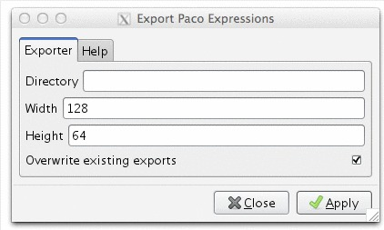</a></li>
   <li><a class="th">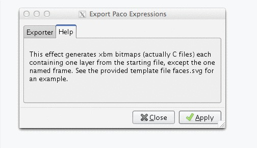</a></li>
</ul>

My extension provides the capability to create several expressions, each in his own layer, with Inkscape vector tools, and export them as separate xbm files in a given folder. It does do rendering all layers individually as png bitmaps, then using Imagemagick convert tool to obtain the xbm files. I'm using this format because it's contents is actually a C array, just as the one needed by the microcontroller compiler.

<ul class="small-block-grid-2">
   <li><a class="th">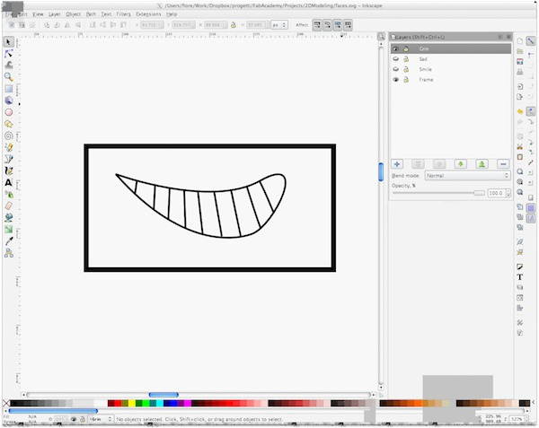</a></li>
   <li><a class="th">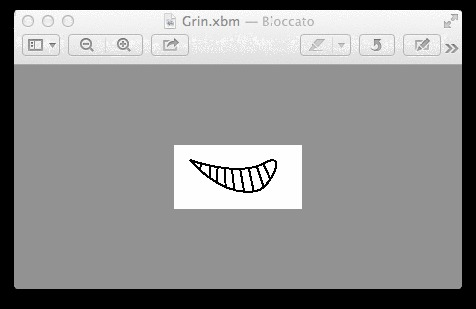</a></li>
</ul>

<blockquote>
    One caveat: I found out there's some limitation when using Imagemagick with Inkscape prebuilt binary on OSX, as the application itself includes a partial copy of Imagemagick library. This can be solved by building and using Inkscape from homebrew. This shouldn't happen on Linux, but I have not tried. I would have investigated this further, but the Inkscape Wiki holding most of the documentation about extensions is offline since beginning of the month, this happens sometimes with opensource projects.
</blockquote>

_Lesson learnt_

Developing this small utility, I had the opportunity to learn more about the Inkscape API and found out that this tool is much more powerful than I imagined. Combining a user friendly interface with complete control offered by the extension mechanism allows to achieve very good results, as proven by the wealth of extension available, ranging from l-system and voronoi generators to wizards for creating cardboard boxes.

Even if I didn't have the opportunity, mostly because of lack of time, to dig more in other 2D programs, especially the more advanced CAD software. I used [Draftsight](http://www.3ds.com/products-services/draftsight/overview/) mentioned by other students during the class, for my [Woody UI](http://github.com/fibasile/woodyuikit) project and found it very useful for making precise drawing for lasercutting. I would recommend it strongly for any kind of similar task, and plan to use it extensively in the future classes.

###3D Modeling

During the first assignment I had modeled a concept for my project using Modo, a quite advanced commercial software package I have used for some game development projects. The modeling approach I usually follow when using this package is called box-modeling: you start roughing up the shape you desire to achieve using cubes and other square shapes, then use the polygon subdivision features provided by the software to produce a smoother and more detailed version of the model, possibly making use of the "sculpting" tools.
This approach works well for organic shapes, advanced texturing and static rendering, but often needs an additional step, basically redoing topology using only square polygons for creating low-poly versions suitable for realtime rendering.

    <a class="th">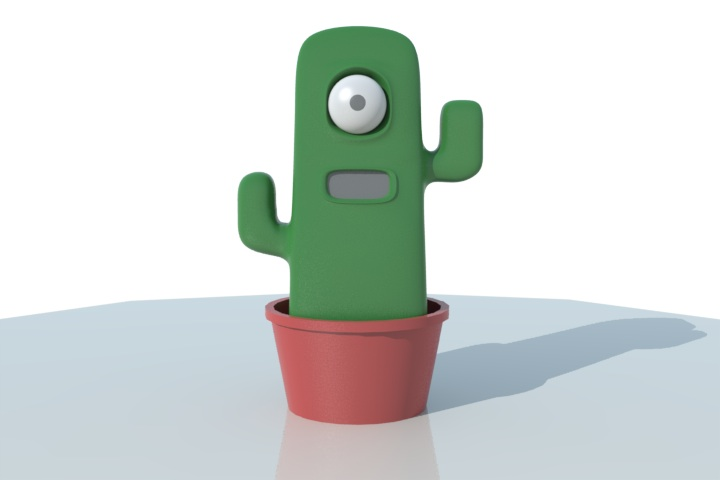</a>
     The initial concept modeled in Modo

In this assignment, I don't need low poly models or static rendering, instead my experiments with 3D models had two different objectives. The first was to create a detailed and watertight 3D model of my project, good for example for feeding it to a 3D printer, and the second to validate the possibility to realise a parametric version of it, possibly allowing the final user to customise the digital companion look at will.

###Modeling for 3D printing

In order to achieve the first objective, a ready to print model, I explored several packages. Starting from the simpler ones I didn't find Sketchup nor 123D design suitable for the task. While it was easy to rough out my concept, it looked quite difficult to add the details I wanted, without resorting to lots of repetitive tasks.

I decided then to use [Rhinoceros](http://rhino3d.com), as many suggested it as perfect tool for the job. I must say that even without much training the software is very intuitive. During the first few hours I was able to create my concept shape out of curves, achieving a decent result without much effort.

Watching few tutorials explaining the main tools allowed me to progress even further, smoothing edges, assigning materials and so on. Overall I find this tool very interesting, having the feeling I have just scratched the surface of its capabilities. I plan to study it in much more detail and make it part of my work toolset in the future.

    <a class="th">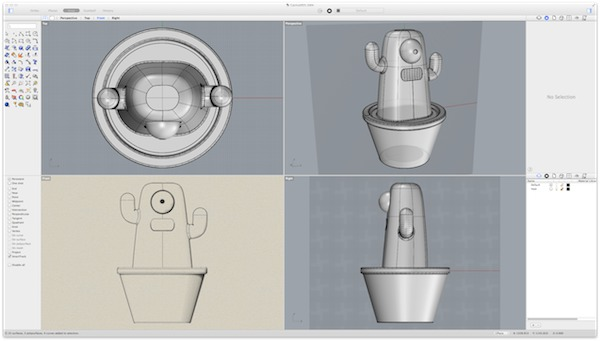</a>
     The concept modeled in Rhino

###Parametric modeling

The software packages I tried for creating a configurable version of the digital companion were [Kokopelli](http://kokompe.cba.mit.edu) and [OpenSCAD](http://www.openscad.org).

Kokopelli, even if I have years of experience in python programming, proved to be quite a challenge when doing 3D modeling of my concept. I understand the power of the provided API but got frustrated by the lack of ready to use shapes apart the basic ones. One severe limitation in my opinion is the lack of an API for creating meshes out of polygons or triangles. I understand this is probably due to the more 2D inclination of the software, but this got me to move on to a different tool for this task. But I plan to get back for a second test for the CNC projects.

I managed then to build a basic version of my concept using OpenSCAD. I used only one extra function from the MCad add-on library to make rounded cubes, relying on the core language for the rest and found it quite intuitive. Being able to build shapes using triangles was a real plus.
Using variables for most values I thought could be changed, and trying to compute the others in relation to those made it easy to create a parametric model.
I must admit that the experience in creating resolution independent GUI helped a lot in this process.

    <a class="th">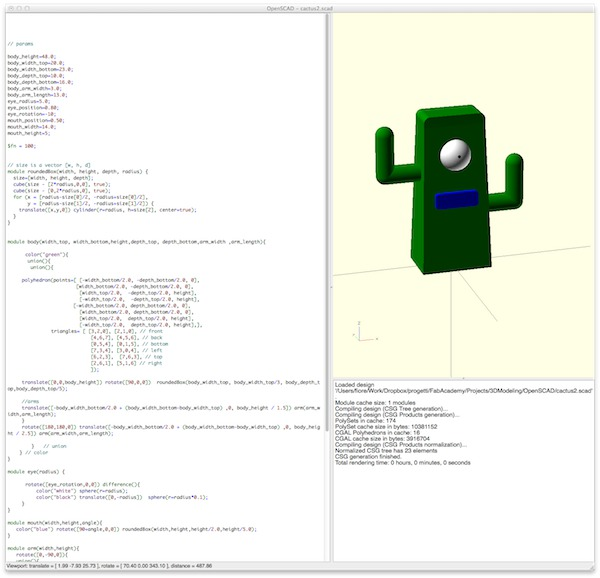</a>
     The parametric model in OpenSCAD

The real limitation I found for OpenSCAD is in the interface. In order to change the parameters, the user needs to identify variables and change them in the sketch, the recompile it to see changes. Additionally there's no undo function for restoring the previous values after changing them! Finally I wanted to make casual users play with the shape, not requiring a lengthy download of OpenSCAD for doing it.

The solution I found is called [OpenJSCAD](http://openjscad.org)! The Software provides a 1:1 mapping of OpenSCAD features, just implemented in Javascript, running in a webgl enabled browser. Additionally this package also provides an automated translator from one file format to the other.
Unfortunately such tool didn't prove very useful: all variables in the source files get substituted in the javascript files with actual values.
But rewriting the model was not very difficult. Additionally OpenJSCAD gives the possibility to define which parameters are exported by the model along with default values and an explanation text.
Finally users will now be able to quickly change the companion model height, thickness, the eye and mouth position in their browser, export an STL file and print the case.
Of course the model is still very rough and much different from the one created in rhino, but I will investigate how to achieve a better result maybe merging the two results.

    <a class="th">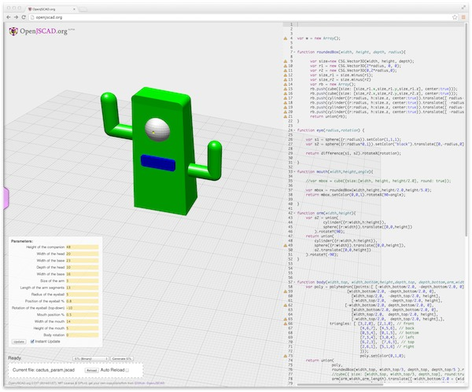</a>
     The model ported to OpenJSCAD, with parameters in a separate panel

You can see the actual model in your web browser following [this link](http://openjscad.org/#http://pastebin.com/raw.php?i=jVbhYbYD) using Chrome, Firefox or a recent Safari.

###Checking the models

As a final step for this assignment, I checked the models with the popular [Meshlab](http://meshlab.sourceforge.net) utility. This software
allows not only to preview 3D models in a wealth of file formats, but also provides editing capabilities, for example to fix errors often
not evident in 3D modeling applications. Some of these features include removing duplicate vertices, unused faces, as well as recreating
broken meshes and retopology operations.

For testing I used the STL files produced by both OpenJSCAD and Rhino, and for both files Meshlab was able to find duplicate vertices and fix them.

<ul class="small-block-grid-2">
   <li><a class="th">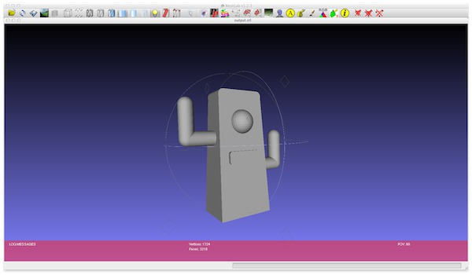</a></li>
   <li><a class="th">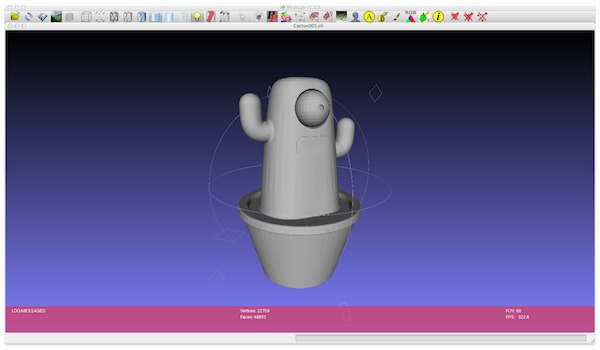</a></li>
</ul>

I am sure that Meshlab will prove very useful when moving from modeling to actual fabrication.

###Conclusions

The software packages I've had the opportunities to explore proved to be very powerful as I imagined. I think I will benefit a lot mastering the Inkscape scripting iterface, expecially when I'll be needing to generate 2D drawings using algorithms as well as for automating tedious tasks. My extension needs some documentation and more examples, but will hopefully reduce the effort needed when developing the expression display module of my project.

Finally, I plan to keep studying on Rhino, as I need to refine my model, especially because I will soon need to model the interior of the digital companion case, slicing it in two parts and adding support structures for sensors and control board.
 

###Source files

- Inkscape model: [cactus.svg](../files/week02/cactus.svg)

- Inkscape extension and installation instructions: [github project](http://github.com/fibasile/paco-expression) 
  
  Extension source [paco-express.inx](../files/week02/paco-express.inx) and [paco-express.py](../files/week02/paco-express.py) 
  
  [test file](../files/week02/faces.svg) and [sample output](../files/week02/Grin.xbm)

- Rhino model: available on request, not included here as model is 1.5Mb

- The OpenSCAD sketch: [cactus2.scad](../files/week02/cactus2.scad)

- The OpenJSCAD sketch: [cactus.jscad](../files/week02/cactus_param.jscad) 
  
  Chrome,Firefow preview [link](http://openjscad.org/#http://pastebin.com/raw.php?i=jVbhYbYD)