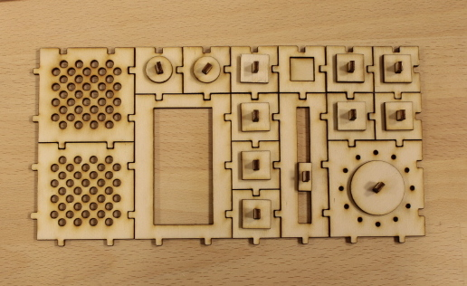

<ul class="breadcrumbs">
	<li><a href="../index.html">Home</a></li>
	<li><a href="./index.html">Classes</a></li>
    <li>Week 3</li>
</ul>

#Computer-Controlled Cutting


###Introduction
This week assignment was to create a press fit kit to be realised using cardboard and the laser cutter. The kit should allow to create different objects and be parametric on the material thickness and quality. Furthermore we were asked by our instructor to design and produce stickers of different sizes to be cut on the vynil cutter.


###Press fit kit

For this part of the assignment I researched several designs, for both press-for joints and creations made with this technique. I found out that many interesting objects have been built this way, from statues, to dinosaur figures, doll houses, lamps and so on.

On the technical side I found that many variations of the press-fit joint are available. An interesting fact is that some of them are also used for fitting industrial products and construction materials. For example press fit can be used for joining copper tubes, and most plastic enclosures use some to hold part together without using any glue or screws.

Concerning press-fit cardboard objects I found very few examples of non-decorative objects, so I thought it would be interesting to explore some design that could be instead used for real projects or at least for prototyping.

###The press fit dashboard kit

My concept is to create a press-fit kit allowing to prototype electronic product enclosures, literally their user interface.

I would use the basic press-for joint design presented in the class, and create several "widgets" that can be combined to create a dashboard interface, allowing later to replace or integrate actual buttons, displays, sliders, etc. Into the lasercut shapes.

A box could be designed to complete the enclosure, for example using wizards like [boxmaker](http://boxmaker.rahulbotics.com), [magic box](http://magic-box.org) and so on.

The result I wanted to achieve was to allow to build something like the following:

<div class="text-center" style="margin-bottom:20px;">
    <a class="th"></a>
    <br/>a dashboard interface example
</div>

As suggested by my instructor I decided to design the press-fit dashboard kit using Kokopelli, which basically helps to create a complete MathTree to be fed into the libfab, the library powering the fab modules, to produce a vector output suitable for the lasercutting.

Since this tool uses Python as its base description language, I also decided to code the dashboard kit script using an object-oriented approach, as I saw very little examples on doing this with Kokopelli, and automate the task further providing an easy configuration driven tool.

###Requirements

Before looking at the script's structure and results achieved, these are my requirements for the kit:

- The script should be based on the concept of creating a parametric matrix over which widgets can be layed out, specifyng 
x,y coordinates as well as their size in terms of rows and columns used.

- Everything should be parametric, including size and shape of slots and pegs, material thickness and other elements. Pegs and slot should be layed out in the matrix in a convenient way, such position should be changed easily for each specific widget.

- Any widget could be as big as the user wants, and scale up to the required dimension without significant issues. 

- Furthermore widgets should have a 3D look, giving the possibility to integrate real electronic components in a second phase. 

- Each widget could provide "accessories" extending their space in rows and columns, and which should be cut along with their major shapes to complete their look.

- Widget should be labeled and label position changed easily

- Finally the position / layout of a dashboard should be defined in a compact format like Json, allowing to develop a web GUI in the future for making the design even more convenient.

###Code structure

My Kokopelli script [dashboard.ko](../files/week03/dashboard.ko) contains the complete code for the dashboard kit. A versioned copy is also available in the [github repository](https://github.com/fibasile/press-fit-dashboard), where I'll be improving it for future project.

The code follows a simple class model, depicted as follows:

<div class="text-center" style="margin-bottom:20px;">
    <a class="th"></a>
    <br/>the press-fit dashboard kit class diagram
</div>
 

The class hierarchy models the different widgets as instances of several specialized version of the general DashboardWidget class, which in turn derives its basic behaviour from the DashboardMatrix and DashboardShape abstractions.
The former provides actual placement of widgets on the grid, while DashboardWidget takes care of attaching
to each widget the slots and pegs in a configurable way. These are represented by a DashboardJoint instance, which can take the form of a slot or a peg based on a property.

Finally any widget list can be rendered using one of the two DashboardRender specializations. The DashboardPreviewRender which arranges the widgets according to the grid and hides any slot and pegs, so a complete shape can be shown for instance to make a sticker. The DashboardCuttingRender which lays out the widgets, including any accessories over a defined area, trying to optimize the used material using an algorithm I recycled from sprite packing tools used in video games.

###First tests

The first tests showed that this script provides a sound structure for satisfying my requirements.

The possiblity to customize the widgets in every aspect also gives me the freedom to experiment with different sizes,
type of joints and even to add new widgets in the future.

<div class="text-center" style="margin-bottom:20px;">
    <a class="th"></a>
    <br/>the first pieces of press-fit dashboard kit in Kokopelly
</div>

Being able to interactively test the widgets in kokopelli made easy to refine the design iteratively and immediately test the output.

<div class="text-center" style="margin-bottom:20px;">
    <a class="th"></a>
    <br/>the first pieces of press-fit dashboard kit exported to Inkscape
</div>


###A complete dashboard example

In order to demostrate and to test the tool, I designed a basic interface for an FM Radio. The interface should have two speakers, several buttons for selecting different memorized stations, a volume and a loudness knob, as well as a slider for hopping between frequencies. An LCD screen could be used to display all this data. Even if its a fictional device it could be turned into a real "paper-tronics" project with some work.

The actual code for creating the FM Radio looks like the following:

    shape_list = [
        {'type' : 'button', 'pos_x' : 0, 'pos_y' : 0, 'rows':2, 'cols':2, 'label': '','label_pos':'bottom'},
        {'type' : 'dial', 'pos_x' : 2, 'pos_y' : 0, 'label': '','label_pos':'top' },
        {'type' : 'slider', 'pos_x' : 0, 'pos_y' : 2, 'label': '','label_pos':'bottom' },
        {'type' : 'button', 'pos_x' : 3, 'pos_y' : 2, 'label': '','label_pos':'bottom' },
        {'type' : 'display', 'pos_x' : 0, 'pos_y' : 4, 'label': '','label_pos':'bottom' },
        {'type' : 'knob', 'pos_x' : 3, 'pos_y' : 4, 'label': '','label_pos':'bottom' },
        {'type' : 'knob', 'pos_x' : 3, 'pos_y' : 5, 'label': '','label_pos':'bottom' },
        {'type' : 'speaker', 'pos_x' : 0, 'pos_y' : 6, 'label': '','label_pos':'bottom' },
        {'type' : 'speaker', 'pos_x' : 2, 'pos_y' : 6, 'label': '','label_pos':'bottom' },
        {'type' : 'button', 'pos_x' : 0, 'pos_y': 3, 'label' : '', 'label_post': 'top'},
        {'type' : 'button', 'pos_x' : 1, 'pos_y': 3, 'label' : '', 'label_post': 'top'},
        {'type' : 'button', 'pos_x' : 2, 'pos_y': 3, 'label' : '', 'label_post': 'top'},
        {'type' : 'button', 'pos_x' : 3, 'pos_y': 3, 'label' : '', 'label_post': 'top'},
    ]
 
Each shape is defined as a dictionary with the following properties:

- type: the kind of widget we want to place
- pos_x, pos_y: the position in the matrix for the upper left corner of the widget
- rows, cols: how many rows and cols the widget spans
- label: a text label for the widget
- label_pos: top or bottom position for the label

The rendered version of the above example looks like the following:

<div class="text-center" style="margin-bottom:20px;">
    <a class="th"></a>
    <br/>A kokopelli generated preview of the radio
</div>

This is generated by the DashboardPreviewRender class, while the cutting version generated by the DashboardCuttingRender
looks like this:

<div class="text-center" style="margin-bottom:20px;">
    <a class="th"></a>
    <br/>Kokopelli also generates the file ready for cutting
</div>


###Calibrating the design

In order to be able to achieve a good fit I did several iterations calibrating the constants defined in 
DashboardGlobals to match the characteristics of the material used.

    class DashboardGlobals:
          square_size = 3
          slot_width = .4
          peg_width = .55
          slot_height = .4
          champher = .2
          pole_width = .6
          pole_height = pole_width*2.5
          material_height = .22
          text_height = slot_height*0.65
          padding = .8

As a first step I used a guide tool made by the other students in the lab, picking a 2.2mm slot
size for the first test.

<div class="text-center" style="margin-bottom:20px;">
    <a class="th"></a>
    <br/>Smart tool to test all the slot sizes
</div>

Unfortunately this didn't give good results for my design as the pegs and slot were too small to hold together
the different widgets. So I started to gradually increase the slot width and the peg width as shown in the following
picture.

<div class="text-center" style="margin-bottom:20px;">
    <a class="th"></a>
    <br/>Testing different sizes for slots
</div>

The final settings of slot_width equal to 4mm and peg width of 55mm resulted in a good fit between the components.

<div class="text-center" style="margin-bottom:20px;">
    <a class="th"></a>
    <br/>Different widgets start holding together
</div>

The main issue is that such fit won't hold very well any kind of "interaction" with the dashboard, so I need to find a different solution for fitting the materials.

###Results achieved and lessons learnt

I'm satisfied with the overall results of the tool. The following picture shows that at least at a conceptual level
the dashboard press-fit concept can produce a pleasant output, that I feel can be useful for design purposes.

<div class="text-center" style="margin-bottom:20px;">
    <a class="th"></a>
    <br/>Small widget assembled
</div>


The major issues I found are related to my choice of using press-fit joint with an horizontal design for cardboard and some minor problems with the Kokopelli software I used.

**Kokopelli**

Overall I can say the software proven to be quite solid, suffering only some memory leak issue when reloading the same script many times.

While working on the script I found few issues:

When subtracting text labels from shapes the actual result was an empty space. I noticed this would happen only when the text contained a spece. I opened [an issue on Github](https://github.com/mkeeter/kokopelli/issues/9) for this and the author promptly fixed it.

Another issue is that when labels are specified into the spec file, the SVG export function suddenly makes CPU usage jump to 100% and basically makes export unavailable. For this reason my designs are not containing for now any label. But these could be easily specified using the label property. The problem doesn't occur when exporting to PNG, so I think
it's related to the complexity of the text shapes exported in vector format.

Finally I found out that in some cases, when exporting to SVG two joined shapes having an overlapping edge, the resulting svg shape contains an edge separating the two shapes. This results in unwanted cuts where there should be a solid shape.
I temporarily solved this problem by moving one of the two shapes edge down by multiplying is height by 0.99999, proving this must be due to some rounding issue introduced when rendering.

I didn't create yet github tickets for the last two issues as I still need to make small test cases for the author to validate the bug.

**Cardboard for the dashboard kit**

Using this design with cardboard has proven to be a challenge. I have used IKEA carboard, and a second type from the box of the iModela machine. 

For the IKEA cardboard we have used the following parameters on the FullSpectrum Hobby 5th gen 40W machine.

    Speed: 100, Power: 50

The material is very irregular so each test need to be repeated many times, especially for configuring cutting power.
For instance the standard settings also used by my collegues for their project with similar boards, wasn't sufficient to cleanly cut the other board which was of the same thickness but with a different rigidity. I think that using 60 as power setting would provide better results for this specific kind of cardboard. Unfortunately we didn't have more available to try this setting.


<div class="text-center" style="margin-bottom:20px;">
    <a class="th"></a>
    <br/>The complete FM Radio dashboard, not totally cut
</div>


I also found out that while the standards joints I'm using work very well when fitting perpendicular surfaces, no matter how much interference is created by varying material sizes, it is really difficult to make a solid fit for joining two parallel surfaces.

In my opinion, this is due to the fact that corrugated cardboard is just a sandwich of two carboard layers filled with air, so the horizontal section is basically empty, especially when joining two pieces cut from the material in the same direction.

I felt my design would be better suited for other kind of lasercut material such as wood and acrylic.

###A wooden dashboard kit

Given the limitations I found using cardboard for my design I decided to try and make an additional test using wood as a material.

I followed the same process I used for cardboard. Having a bit more experience I immediately started with several tests for the laser power and speed, creating a small test board with parameters in it, till I found the right settings. A similar process followed for the Kokopelli script calibration settings, repeating pairs of dashboard widgets to find the values giving the right fit.


<ul class="small-block-grid-2">
   <li><a class="th"></a> <br/> calibrating laser power and speed</li>
   <li><a class="th"></a> finding optimal values for right fit</li>
</ul>

Using these settings, which allowed to achieve a clean cut and a good fit, I repeated the process cutting all the widgets. Having used a slower speed the cutting left many burnt areas, especially where the laser spent more time
cutting details, such as on the speaker widgets.

<div class="text-center" style="margin-bottom:20px;">
    <a class="th"></a>
    <br/>Finishing the wooden dashboard kit version
</div>

Finally I was able to assemble the FM Radio example using the new pieces. The fit was much more solid than the equivalent made in cardboard. I also redesigned the speakers widgets so that holes could be more spaced and created an overall better and more solid look.

<div class="text-center" style="margin-bottom:20px;">
    <a class="th"></a>
    <br/>Assembled wooden FM Radio dashboard<br/>
</div>
<div class="text-center" style="margin-bottom:20px;">
<a class="th"></a>
</div>


###Making vynil cut stancils

During the week I mostyl used the laser cutter, but luckily found some time also to explore the possibilities given by the vynil cutter. I managed to find a small logo of my favourite sci-fi movie and created some stickers for my laptop.

The stickers where created starting from SVG files, but they were converted into PNG files for processing,  because of some error in Fab modules due to incorrect parsing of non-ascii character present in files.

<blockquote>
I think this might be due to the fact that SVG files are not parsed using the ```codecs``` Python module, but rather opened using the normal Python ```open()``` api. I will report this finding to the authors in order to get this issue fixed in the software.
</blockquote>

Using PNG files with the fab modules on the other side was quite straightforward, given the vector nature of SVG I was able to create files at high resolution which resulted in a very good trace result.

<div class="text-center" style="margin-bottom:20px;">
    <a class="th"></a>
    <br/>First sticker with small typeface
</div>

I initially tried to add to the sticker some text in a quite small typeface. This made the whole process really difficult, because letters were too small to stick well and the fill of some letters required some patience to be separated by the transfer tape. I eventually managed to transfer it on a wooden board, but had to relocate some smaller elements practically by hand.

As a second try and using bigger letters, I cut again a similar logo, this time the process was very smooth, and I easily managed to transfer the logo on my laptop with the transfer material, as shown in the picture.

<ul class="small-block-grid-2">
   <li><a class="th"></a>
    <br/>Small sticker applied</li>
    <li><a class="th"></a>
        <br/>Larger sticker applied</li>
    
</ul>


###Conclusion

I really liked the simplicity and immediate results offered by the large vynil cutter available in the Beach Lab, much more advanced than the small A4 cutter I had used previously. The ability to cut in different parts of the material and to exactly know the area available for cutting allowed me to reuse the same vynil for several tests.
Also the possibility to use the transfer sheet for moving the stickers from one surface to another is a great improvement
from my previous workflow.

###Source files

Kokopelli Dashboard script [dashboard.ko](../files/week03/dashboard.ko)


