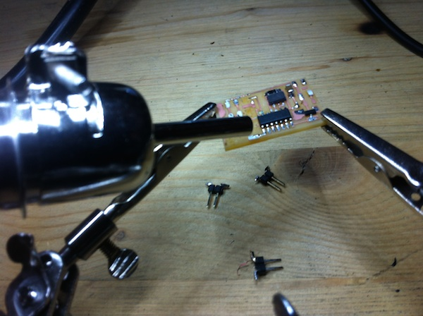

Electronics Production
======================


This week assigment is related to producing printed circuit boards. In
particular we were asked to mill, stuff and program the Fab ISP board, which allows to
program brand new AVR microcontrollers with the desired firmware.

As an additional goal I also wanted to produce another board for
Servo control, which I plan to integrate in my Digital Companion final project
to manage the Pan-tilt movement of the camera embedded into the companion eye.

FAB ISP 
--------

The FAB ISP design we decided to build in the lab is the [Andy](http://fab.cba.mit.edu/content/projects/fabispkey/index.html)’s version. This
board's design is particularly interesting because it replaces the standard USB
connector with traces milled on the board. The only required addition is some
spacer added on the bottom of the board in order to have the required tickness
for it to properly fit into a normal PC USB slot.

Milling the board   
--------------------

I milled the board starting from the PNG design available on the class webpage,
using the Fab Modules on the lab’s Roland MDX-20 Modela mill.

I never used such tool before so took some time to understand its operation,
especially regarding the homing and fitting the different milling bits for
proper operation.

The process was quite straightforward, and the integration with fab modules made
it very smooth.


For milling the traces I used the 1/64’’ inch bit, while for cutting out the
board from the FR-1 sheet I used the 1/32’’ inch bits.

The machine settings I used are:

- Speed 4, Jog Height 0.8 for milling the traces
- Speed 2, Jog Height 1.8 for cutting the board

At the beginning I didn’t use directly the built in plate of the mill, but put a
quite large wooden block on top of it for precaution.


The first milling experiments where not very successful as traces on the upper
right corner of the board were not milled properly.

It turned out that the block wasn’t uniform, and this was the reason the first
milling tentatives where not successful.

I experimented with different settings for the jog height, homing the mill in
different places of the board to get the lowest possible setting. This finally
resulted in a properly milled board.

>A very interesting fact is that even after several times switching to view
>mode, and  milling attempts the Modela totally respected the homing coordinates,
>resulting in no displacement of the resulting traces.


Cutting out the board took almost the same procedure, and worked quite
immediately. This was done by removing the wooden block and putting under the
milled board another FR-1 sheet instead, which made the calibration process much
easier thanks to the uniform surface.


Stuffing the FabISP
-------------------

Before starting the actual stuffing I took some time to produce a Bill of Materials, matching codes in the schematic with a description and quantity required for each part. This helped me a lot in collecting components from the lab inventory, and will also be useful to track which components are needed to make another similar board in the future.

I also managed to salvage the ISP connector from an old board, so I had all material ready.

 

I had already create some boards using through hole parts, but I had never soldered SMD components before, so found it quite intimidating handling such small parts. Even if I followed my instructor advice I found it very difficult to use the magnifying monocular and my glasses at the same time. This led me to much frustration in getting the connection properly soldered and resulted in not very clean component alignment.


As a lesson learnt, I will equip my soldering workstation with a magnifying lamp allowing me to solder with glasses on and with more freedom of movement. Repeating this process more times I will propably also get more confident and produce better results. The process took me a couple of hours to complete, mostly because I couldn't get some of the components to sit cleanly. Another lesson is I should use less solder possible before adding the components to get an easier alignment.


By testing all the connections to the ATTiny pins I could be more confident while progressing, but later I realized that some of the could be redone in a much cleaner way.

Programming the FabISP
----------------------

Being my first board I wasn't really sure it would work at first. I downloaded the firmware plus all dependencies and followed the make clean, make program cycle using my instructor FabISP plugged on a second USB port. No error message, so I unsoldered the jumper but my board wouldn't be recognized.


After several tries, restoring every time the jumper, I couldn't make it work. Then I took a better look at the ```Makefile```. Turned out I needed to uncomment the line invoking avrdude to tell it to use usbtinyisp instead of avrisp. 

    AVRDUDE = avrdude -c usbtiny -p $(DEVICE) # edit this line for your programmer
    # AVRDUDE = avrdude -c avrisp2 -P usb -p $(DEVICE) # edit this line for your programmer


The process this time was successful, my ISP was recognized by OSX, and it also worked for programming one of my collegues board.


Servo Board
-----------

Having completed the assignment I moved to working on my Final project, by producing a [Servo board](http://academy.cba.mit.edu/classes/output_devices/servo/hello.servo.44.png) for managing the camera movement.

I thought this could also be a useful practice for the weeks to come and an interesting way of further using my brand new FabISP.

Milling the board was quite simple this time. I just followed the same process as the FabISP, this time using another copper board under the milled one. I managed to home the modela directly on top the other cuts so not to waste any material and got the board ready very quickly.


I created again a new Bill of materials, but this time had some trouble in finding components out of the inventory. A 22uf capacitor was needed and there were no connectors I could savage. I went on using a single 10uf capacitor since this was not a critical component as suggested.

  

Stuffing the components on the board was much easier this time. The solder on ATTiny this time looked shiny and clean.

<ul class="small-block-grid-3">
    <li> </li>
    <li> </li>
    <li> </li>
</ul>    

Unfortunately I can't say the same for the different 6 pins connectors. Creating them for a single strip of straight pins has not worked well, so I ended up with very loosy and irregular connectors. Trying to fix them even made them worse, at the end some traces lifted from the board, resulting in a wasted work. I also later realized that I used the wrong component for the voltage regulator, and have some doubts on the crystal as it has only two pins instead of the 3 pins shown in the board picture.

Fixing the servo board wasn't possible, but I could still learn some more. I decided to mill a new one and try again, this time putting some glue on connectors to make them stick together, so it would be much easier to solder them in place. 

I also wanted to salvage most of the components used, using the copper braid to remove the solder. Unfortunately this wasn't enough, as it was still not possible to remove the IC. I found out that in order to remove it I needed an hot air gun.


Conclusion
-----------

I enjoyed much this week assignment. Being able to create from scratch a working board and programming it made the process very rewarding.
I didn't manage to complete the servo board, but will work on it and update the page with my findings later in the week.


Update March 4th, 2014
----------------------

I managed to stuff and program the servo board.

For stuffing the board, I needed to correct my BOM using a Resonator instead of the Crystal, and to use the 1A Voltage regulator instead of the 0.1A one I indicated in the previous bom. 

The updated BOM will now look like the following:


    
I was able to savage most of the existing components using and hot air gun. The tool I used it is the [ATTEN AT8502D 2 in 1 Lead free rework station](http://www.atten.eu/solder-rework/atten-at8502d-2-in-1-lead-free-rework-station.html) I purchased for the Fab Lab Cascina.
The process was very straightforward and required few minutes to complete.


    
I milled a new servo board and stuffed it following the updated BOM. This time I dedicated more attention in soldering the connectors, which resulted quite solid.


    
The board will power the pan-tilt mechanism of my Digital Companion, as shown in the [activity log](../project/log.html) using the
[2 Channels Software PWM Firmware](http://academy.cba.mit.edu/classes/output_devices/servo/hello.servo.44.2.c).


