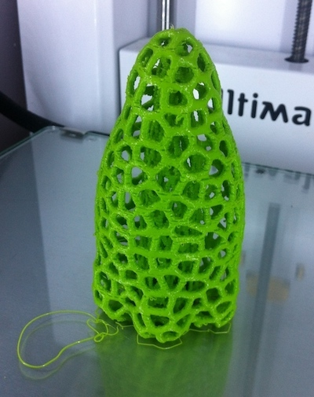

3D Scanning and printing
========================

This week assignment is about creating a 3D model which cannot be made subtractively and print it, and possibly 3D Scan an object and try to print it too. I made several experiments for both tasks, using different software and approaches.

Modeling a 3D object for printing
---------------------------------

My modeling skills are not very advanced, and I don't consider myself an artist. But I'm very fascinated from the abstract 3D prints you can find on the internet today. As far as I understand these are usually created using a procedural approach, mostly using Rhino Grasshopper plugin for example.

I wanted to experiment such approach but don't have access to Grasshopper, so I tried to replicate similar results using FabModules, OpenSCAD, Meshlab, with some help from Modo, my favourite 3D package for basic mesh editing.

Also I was interested in studying the inherent limits of the FDM printing, as this is the technique used by the Ultimaker 2 we have in the lab, trying to print objects with and without support structures.

I started with a simple mesh created using OpenSCAD, resulting in an overall shape for a small lamp I wanted to build, by cloning and scaling the same component mesh in order to achieve some organic look.

Creating Voronoi wireframes
---------------------------

Such object would take lot of time to print, even at a small scale. I learnt that many 3D printing experts in this case, usually create empty wireframes instead of solid objects to reduce printing time for big models. Many 3D artists, use the  [Voronoi](http://en.wikipedia.org/wiki/Voronoi_diagram)  wireframing method to achieve this goal, but also for aestetich reasons.

This alghorithm allows to segment a plane into poligons, starting from a point set. Each polygon has the characteristic that all the points in it are closer to the reference point than any other point in the point set. This basically creates a number of Voronoi Cell, whose boundaries when enlarged make up an aestetically pleasant wireframe of a shape. The same process can be applied to a solid object surface, resulting in an organic looking surface, similar to corals.

Voronoi is widely used in computer graphics. Many implementations exist for any programming language, and several tutorials are available on the Internet for creating this effect on 3D Models. I decided to use Meshlab, and went on learning how to create Voronoi wireframes for the modeled objects with it. 

In Meshlab the process can be summarised as follows:

- Open the starting STL in Meshlab
- Reconstruct the mesh surface using VCG Reconstruction algorithm. This produces an appropriate mesh from the original one, also giving the opportuinity to reduce or increase the number of faces depending on the quality of the starting mesh.
- Further smooth the surface using Laplacian Smooth
- Sample the mesh, using the Poisson method, in order to identify the points which will be designated as the lattice points for the Voronoi tesselation.
- Apply the Voronoi Vertex coloring algorithm to the reconstructed mesh. 
- Select faces based on Vertex quality. Tweaking the min and max quality settings allows to produce a thicker or thinner wireframe out of the unselected faces
- Delete the selected faces, thus producing the basic wireframe
- Further smooth the resulting wireframe, using the Taubin algorithm
- Finally with the Uniform Mesh Resampling function you can add depth to the wireframe. This command creates a resampled mesh offsetting all the voxels in the original mesh by a given distance, then applying the Marching cubes algorithm to the resulting volume.

The application of this process to my original meshes resulted into the following:

3D Modeling using an L-System, Inkscape and Fab Modules
---------------------------------------------
    
As a second test, I decided to try the FabModules **gif_stl** to extrude a 2d shape into a 3d object. I wanted to produce a geometric shape not easily made with manual modeling, so decided to investigate using an L-System for it.

An [L-System](http://en.wikipedia.org/wiki/L-system) or Lindenmayer system is a rule-based approach that allows to produce 2D graphics starting from a grammar and a set of rules.
This system is often used to generate trees or building landscapes in computer graphics, sometime adding random elements to produce more realistic results.

For my model I choose a well known rule set, the Peano-Gosper Curve also known as the *flowsnake*, which produces a beautiful path of connected segments. In order to produce a good resolution bitmap, I started with a vector version made with the Inkscape L-System extension.
The axiom and substitution rule used is the following:

I then exported the resulting vector as a bitmap with a size of 512x512 pixels, and inverted the colors. Finally processed it using gif_stl, with a final pass in Meshlab to add more depth to the model, using the Uniform Mesh Resampling function:

<ul class="small-block-grid-2">
   <li></li>
      <li></li>
</ul>

3D Printing the objects
-----------------------

I moved the objects into the Cura software provided with the Ultimaker2 and prepared it for printing.
The lamp mesh required a support structure to be printed, and while this would be possible with other kind of objects, accessing and removing the support structure from the inside of the mesh wouldn't be possible.
I decided to rework the model, using a scaled clone of the same mesh for replacing the support structure. While it's not easy to describe in words or with static models, the internal structure became quite evident during the printing:

The process required a bit less than two hours to be completed, given I scaled the object down to few centimeters in order to reduce the printing time. The printed object shows a significant amount of artifacts due to some filament "skipping" problems during the process, maybe caused by the very small areas covered during each layer, but overall look was retained. I think that in fact these artifact add even more realism to the object.

<ul class="small-block-grid-2">
   <li></li>
   <li></li>
</ul>

Printing the flowsnake was much easier and faster, and the resulting object, also thanks to the small size has a good flexibility, is very detailed, and could be perfect for example to make a pendant or for decorating some book cover.

3D Scanning objects
-------------------

For 3D scanning I approached the task using the iOS version of 123D Catch application. I initially wanted to scan a black hat with a small light bulb on top of it. The 123D Catch application requires to take several pictures from every angle, and it guides the user by showing circles with a number of tabs corresponding to the different required angles, both at the same level of othe object and from a top-view. It does so using the built-in compass of the mobile phone.

<ul class="small-block-grid-2">
   <li></li>
   <li></li>
</ul>

Unfortunately the processing is done on a cloud server farm, so this means that a large number of pictures must be uploaded to the server before processing takes place. I took several pictures for every angle, I guess too many as for the first test, maybe because of lack of good connectivity the upload wasn't successful and processing didn't take place.

As everybody considers 123D Catch the best software in photogrammetry, I made another test. This time also following other expert user advice, I decided not to scan the dark hat, but to pick another more textured object, as this is recommended for achieving better results.

I took again pictures of the subject, limiting myself to just one picture per required angle. After a short upload, also because I was now using a wifi network connection, and some more processing time, I got what I believe is a quite good result.

I was also able to download the generated mesh, which also contained many object surrounding my scanning subject. Reprocessing the scanned mesh required to open it in a 3D editing application and deleting the surrounding meshes. It was interesting to see there were no holes in the initial mesh and the applied texture didn't present any evident artifact or distortion.

The model produced by 123DCatch is available at the [123D Catch website](http://www.123dapp.com/obj-Catch/Catty/2166761)

Additionally the polygon count for the object was very high. I didn't expect that this approach would be generating such a detailed model. In order to get a good model for printing I remeshed and simplified the object in Meshlab, which resulted in a quite low polygon model.

For the second test in 3D scanning I had the opportunity to use a Kinect sensor. The software I used was the free version of Skanect, considered one of the best packages for scanning with Kinect.

The process was a bit more difficult than the one with 123D Catch. There are several reason for this. First of all the Skanect software requires a very smooth and slow movement of the sensor around the object. It also requires a quite powerful computer, probably my notebook was not at par with its requirements. I had to repeat several times the process with the models I tried.

For experimenting with Kinect I tried two models. The same dark hat  used in 123DCatch, and a real human model. 
The dark hat proven to be a difficult subject for the Skanect too. Being uniform in color resulted in a poor quality scanned model, which presented holes on the top and didn't reproduce very well the overall shape of the object. The application provides some features to fix the acquired model, but it deformed the model too much while fixing it. Also, the resulting texture was not matching the object at all.

The second test with the human model, probably because of a much bigger scale did produce a good result. The scanning process was again very slow, and few scanning sessions were required to complete the whole process. The scanned mesh was very detailed, presented no holes and cropping only the torso of the model was straightforward.

<ul class="small-block-grid-2">
   <li></li>
   <li></li>
</ul>

The scanned texture was quite accurate, except for the face of the model which looked distorted, but probably this was due to the model changing expression during the long scanning session. 

Given the limitation of the free version of Skanect, allowing to export only 5000 faces objects, I must say the resolution is still acceptable for a small-size print. I still had to rework a bit the model in meshlab, mainly for smoothing the very sharp edges created by the low-res export.

The resulting model can be easily open in Cura, ready to be printed.

Printing the scanned models
---------------------------

In order to validate the workflow I decided to print the two best models obtained from the scanning session, the cat scanned in 123D Catch and the human model made with Skanect.

The cat model resulted not very perfect print. Even if it had a high resolution, the cropped model obtained from 123D Catch was not manifold, and required fixing using [Netfabb](http://www.netfabb.com) to be printed. This probably altered significantly the shape, also making it skewed on one side.

I will need to investigate if this problem was due to my cropping of the mesh or to the software itself.

On the other side the human model created with Skanect, even starting from a small resolution, was printed successfully, resulting in a tiny but detailed figure.

Conclusion
----------

Having a direct path from a real object to a 3D printed model is very promising and would really make 3D printing technology more useful for the every day life. The technologies I evaluated still require a significant amount of manual processing, and a lot of tweaking.

For deposition 3D printing, the limitations of the technology require carefully made models to achieve good results, but I believe other approaches such as SLS will remove most of them. This is confirmed by the quality achieved by using 3D printing services such as shapeways.

On the scanning side, I didn't have yet the opportunity to experiment with the structured light approach presented during the class, but I'm looking forward to build such a scanner myself and make some experience on this technology. I understood anyway that even the simpler technologies could be rewarding if one knows their limitations. 

Using Kinect with large-sized objects could be really useful, for example to make small human figures. On the other side 123D Catch produced a really good, high-detail model of a small textured object in a short time, and can assist when looking to 3D print or have a reference of a mechanical part or an art piece.

 
