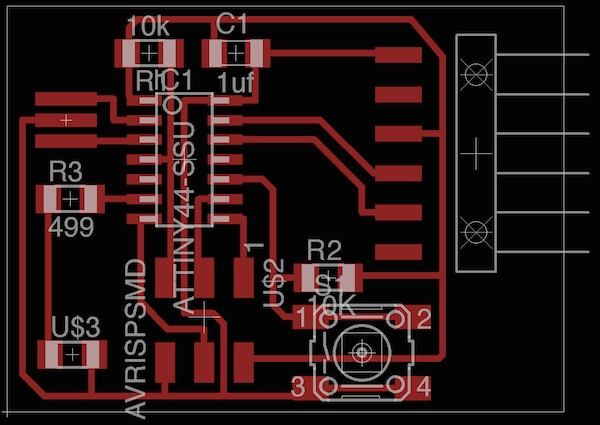

Electronics Design
==================

The assignment for this week is to produce the Hello World board, adding at least a button and an LED to the original design, using some
of the proposed software.
Furthermore we should investigate the tools needed to simulate electronic designs.

A wearable Hello World board
----------------------------

In order to experiment with the electronic design, I started with the goal of creating a "wearable" Hello World board adding
several leds and packaging the board with a round layout, easily adapted for example as a button for a coat or bag.

I first spent some time on the [ATTiny44 datasheet](http://www.atmel.com/Images/doc8006.pdf) in order to have a clear idea of its
pinout, for instance to know at which side each pin would appear as this was not shown in the schematic representation. 

As a sidenote, I must say that the microcontroller itself is impressive, as I didn't think so much functionality could be found in such
a small package. I think it will take some more time to learn everything about it.

Getting back to the board, I started to model the schematics in Eagle, and produced a first design, including four leds and the required resistors, plus a button:

    
The resulting board looks like the following:

    
I must say I didn't look much at first at the original hello board design, in fact I forgot to add the FTDI programming header and the resonator.

For the FTDI header, this example board could live without it, as this design would be more suited to be programmed just once and produce a number
of LED blinking coreography when the button is pressed. At the same time I also think the built-in clock for the ATTiny44 could be enough for the limited
functionality.

Adding more LEDS
-----------------

Since the first example board was not compliant with the Hello World board design, I decided to try another design. This time, apart from adding
the 20 Mhz resonator and FTDI, I decided to have a more traditional square board, but to add six leds and a button instead.

Sketching the schematic I quickly found out that the avaiable pins, after adding the headers and button were only three. In order to support more LEDS I knew I could use a technique called [CharliePlexing](http://en.wikipedia.org/wiki/Charlieplexing), which I heard about in the past but didn't have
yet the opportunity to try in one of my designs.

CharliePlexing in few words allows to control up to n*(n-1) leds with n pins. When using more than 2 pins it does so by switching one of the pins as input rather than output, thus disconnecting the pin from the circuit.

I found this [Instructable](http://www.instructables.com/id/E5COF05YF6EP287ITF/) to be a very good introduction to the technique.  

With this in mind I produced the following schematic:

The main issue I found came with placing the components in a layout. Being a novice at Eagle, I found it quite complex to mix both all the connectors routes and the ones for LEDs. I followed the advice of trying to layout out the board as if it was very big, then moving the parts towards the center
when most of the connections where done.

At the end I had to introduce a zero-ohm resistor to complete the layout and make it compact. Unfortunately Eagle doesn't recognize this and it still
show some of the ratsnest hairlines in the layout.

   
I still would like to improve the design, as my original concept to create a round led board is not achieved. I'm sure that working more on layout
will help to reach this kind of proficiency. 
    
Milling and stuffing and the boards
-----------------------------------

During the week I had problems milling the board because of several milling bits breaking. I'm waiting for the bits recommended by the Fab Inventory to mill and stuff the boards.

Update 22 March 2014
--------------------

As of today I still didn't receive the milling bits for the Modela, but I needed a board to complete the week 8 embedded programming assignment.

As an excercise for fabricating the board with a different tool I decided to use the iModela for fabricating a board. As I wasn't sure about
the output quality with this machine I decided to go the safe route first, and simply modify the HelloEcho board adding one led and one button,
planning for some time to mill and improve the other two designs when I will have all materials and possibly more experience using Eagle.

Approaching production with the iModela also gave me the opportunity to better understand the grid, trace width and take a look at other
pcb cam software different from Fab Modules. 

In order to complete the HelloEcho design in Eagle, I also used this time the network naming functionality, achieving a tidy look for the schematics:

I also routed the board to make space for the new components, changing the traces to avoid 90 degrees turns. As I learnt from some of the tutorials on the Internet this is like a standard practice for better looking boards.

As I mentioned earlier the iModela is not supported yet by Fab Modules, so I needed to use a different software for milling it. 

Asking to some experts and looking on the Internet, I found a tool for milling pcb out of Eagle design called [pcb-gcode]()

This is a ULP (User Language Program), basically a C-like language program that gets executed inside the Eagle runtime environment and can manipulate the design one made in a number of ways.

The PCB-GCode script requires a two step process. First you setup the profile for producing GCode, using the pcb-gcode-setup.ulp script, then you execute the pcb-gcode script on your design.

Configuring PCB-GCode is actually much more complex than Fab Modules. It requires not only to specify the trace width, bit size, insulation amount and so on, but also to tweak the GCode flavour to suit the device used.

Some tutorials are available for setting up the iModela with PCB-GCode, but I must say I didn't find a completely workable one. A good starting point is this [profile](http://www.mariolukas.de/download/imodela.pp) 

As of today I didn't find an optimal configuration for the PCB-GCode - iModela combination. But my tests showed that you can produce an acceptable result
using a combination of a 45 degrees engraving tool and an 0.8mm drill bit. I will further detail my configuration as soon as I get it really working.

My milling tests with iModela resulted in the following

Finally I could stuff the board and move on to the next assignment.

Testing the design
------------------

As suggested during the class, I investigated the options for testing the circuit before building it. I found many packages deal with the
actual simulation of the AVR microcontrollers.

One which I found very easy to use is the [123d Circuits app](http://123d.circuits.io/).

Following another instructable article I found this "sketch": [Charlieplexed Arduino 8x8 LED Grid Display Shield](http://123d.circuits.io/circuits/102918-charlieplexed-arduino-8x8-led-grid-display-shield) which shows charlieplexing in action on an 
Arduino Board.

The 123D Circuits app is really simple to use, and simulator itself is very nice showing the actual board working with LEDs lighting. I must
say that even if not very accurate, this makes quite simple to experiments designs without leaving the browser window.
As a plus the user also gets a complete bill of materials, a schematics and a reference for putting the circuit together also on a breadboard.

Trying to find more advanced options, I found the [SimAVR](https://gitorious.org/simavr) software. This is a much lower level simulator,
providing a complete simulated AVR microcontroller to be used for debugging firmwares.

The software itself is fully integrated with the AVR-GCC toolchain, and basically talks directly to avr-gdb to trace the code on a line-by-line basis.
All the internals of the AVR micros are present, included timers, EEPROMS and so on. It also allows to design Virtual PCB around the simulated
micro, in order to test the whole circuit.

Once [installed](https://gitorious.org/simavr/pages/GetStarted), you can run a generic firmwarefile with symavr, also specifying the required AVR model to be emulated.

     ./simavr/run_avr -m attiny44
     
then launch the avr-gdb and load the elf file produced by avr-gcc. The full process is explained in this [tutorial](http://ingo.orgizm.net/blog/articles/2012-02-02-simulating-and-inspecting-code-with-gdb-and-simavr).

I didn't dig much into this software, but I believe it is very powerful. Especially the "board_simduino" example is amazing in the fact that it allows to load a bootloader into the simulated AVR and program it like an actual Arduino.

Conclusions
-----------

I feel that in this week I just scratched to surface of the wealth of skills, techniques and tools needed for producing good electronic designs.
The PCB layout alone looks really like an art that will take lots of practice to be mastered. I'm also very fascinated by the circuit simulation tools, for which the many options available really require more dedicated time to be full understood.

Files
-----

The following files contain schematics and layout for the two design:

- Wearable Hello Board [brd](../files/week06/brightbutton.brd) [sch](../files/week06/brightbutton.sch)
- Charlieplexing Hello Echo Board [brd](../files/week06/brightbuttonftdi.brd) [sch](../files/week06/brightbuttonftdi.sch)
- Redesigned Hello Echo Board [brd](../files/week06/helloecho.brd) [sch](../files/week06/helloecho.sch)
