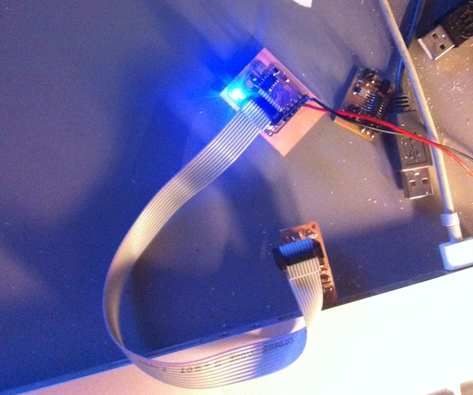

Embedded programming
====================

This week assigment is to study the ATTiny datasheet, and to program it in as many languages as possible.

Getting ready for programming
-----------------------------

Before starting I must say that I spent significant time getting my Hello Echo board from the electronics design week accepting some programming.

What happened is that I actually redid the board several times. At first I was not confident with the one produced using the iModela, as the traces looked very very thin. This was what I blamed the first time I attached the usbtinyISP and got the (quite popular, as proven from google search results) rc=-1 connection error.

Redoing the board, by unsoldering all the components with hot air and placing them again on a new one milled this time on the MDX-15 finally equipped with the proper bits and FR-1 sent by FabLab BCN people, changed the result very little.

I excluded immediately the programmer, it was working fine with the Servo board I built during the previous weeks.

I then started investigating all the possible causes, checking (again) any single route, the board looked correct.  This is where the first good hint came from the ATTiny44 datasheet. By measuring the voltage coming from my FTDI cable, I realized it was 3.3v and not 5v like it should have been. As section 20.3 of the datasheet says "The maximum operating frequency of the device depends on VCC.", so in order to work at 20mhz the ATTiny should be powered at least by 4.5V!

I then powered the board hooking the VCC and Ground pins of the FTDI connector to a normal Arduino, this got me a bit closer to the solution. Now the board was accepting the program-usbtiny-fuses Makefile command. But nothing more, and just once.
And again the rc=-1 error.

To make a long story short, I finally discovered the resonator mounted on the board was not working. Possibly it was damaged by too much heat during the solder, heat, unsolder, repeat process I did many times.

Finally my board was ready to blink, as shown in the picture. 

    
> As a sidenote, it would have not been blinking if I didn't read during the last days my instructor's report from last year 
> FabAcademy! In fact when soldering the LED I googled for "SMD LED polarity", and found the same page containing a wrong 
> picture he found when he did the same search. As he mentioned Internet is cool, but don't blindly trust what you
> find. Checking the part number on digikey and downloading the datasheet saved me few hours of additional desperation.

The blinking was achieved with the code below, replacing the main() code into the hello.ftdi.44.echo.c by neil:

    #define led_port PORTA // port where led is attached
    #define led_direction DDRA // related direction register (i/o)
    #define led_pin (1<<PA7) // pin where led is attached

    output(led_direction, led_pin); // tell led pin is output

    while(1){
        set(led_port, led_pin); // put pin on HIGH
        _delay_ms(1000); // wait a sec
        clear(led_port,led_pin); // put pin on LOW
        _delay_ms(1000); // wait another sec
    }
  
  
Some real programming
---------------------

After all the time spent making work a board that simple, I wanted to explore some of the languages supported by the ATTiny, leaving creating other, more interesting boards such as the FabDuino, for upcoming classes and my final project.

Assembler
---------

The first language I wanted to explore is Assembler: so many years have passed since list time I coded in this language.  I still believe this is very practical, especially since it doesn't have any dependencies. You need no IDE, external library,
and very little software is between the programmer and the machine. The less the software, the less the chance to be blocked by bugs or inconsistent user interfaces. On the other side I know for sure it is a very difficult task to maintain, or share assembler code between different programmers.

All the Assembler programmer needs can be satisfied by the datasheet, for the ATTiny this means looking at the following: the 10.1 section on I/O Ports, 10.2 section on Alternate Port usage, and the section 23 on the instruction set, not forgetting the (quite long) list of specialized and general purpose registers on section 22.

Even if this is general rule it's often true, it is useful to rely on some guide or tutorial to get started: I recommend [this tutorial](http://www.avr-asm-download.de) as a gentle introduction to the subject, I honestly found it very practical to get up to speed. One of the gems inside is the suggested layout of a ASM program:

- header with author and copy(left) information
- section with hardware information
- ports and pins definition with symbolic names, i.e. .equ LEDPIN = PORTA2
- constants that can be configured .equ CONST1 = VAL
- fixed and derived constants
- register definitions using the .def reg=R15 format
- memory definitions
- reset and int vectors
- interrupt service routines
- main program init
- program loop

With all of this in mind, here's my version of the previous blink example:

    ;
    ; hello.ftdi.blink.44.asm
    ;
    ; Simple Blink in ASM
    ; Fiore Basile - FabAcademy 2014
    ; Public Domain

    .include "tn44def.inc"

    .equ led_pin = PA7; led pin is PA7
    .equ led_port = PORTA; comm port
    .equ led_dir = DDRA; comm direction
    .equ led_pins = PINA; comm pins
    .def bitcnt = R16; bit counter
    .def temp = R17; temporary storage
    .def temp1 = R18; temporary storage
    .def counter1 = R20;
    .def counter2 = R22;
 

    ; program is in lower part of memory
    .cseg
    .org 0
    rjmp reset 

    ;
    ; main program
    ;
    reset:
       ;
       ; set fuse low byte to 0x7E for 20 MHz resonator
       ;
       ; set clock divider to /1
       ;
       ldi temp, (1 << CLKPCE)
       ldi temp1, (0 << CLKPS3) | (0 << CLKPS2) | (0 << CLKPS1) | (0 << CLKPS0)
       out CLKPR, temp
       out CLKPR, temp1

       ;
       ; set stack pointer to top of RAM
       ;
       ldi temp, high(RAMEND)
       out SPH, temp
       ldi temp, low(RAMEND)
       out SPL, temp

       ; set pin to output
       sbi led_port, led_pin
       sbi led_dir, led_pin

       ;
       ; start main loop
       ;
       loop:
           sbi led_pins, led_pin
           rcall counta
           rjmp loop

       counta: ldi counter1,0
       pausea: rcall counta
               dec counter1
               brne pausea
               ret
           
       countb: ldi counter2,0
       pauseb: dec counter2
               brne pauseb
               ret
           
           
       

In order to compile it, you need to download and install the [AVRA assembler](http://avra.sourceforge.net), and the provided [tn44def.inc](../files/week08/tn44def.inc)

Other languages
---------------

I planned to program my board with several other languages, most importantly the two interpreters proposed during the class, AVRSH and Python on a chip. Unfortunately I managed to break my board FTDI connector just after completing the above assembler program. I must admit I'm still not good at soldering pins on the SMD pads, as these are often a source of frustration for all the electronic boards I built since the beginning of Fab Academy. I will repair the board and update the page by the end of the semester.
  

Files 
-----

Hello blink (asm)
[hello.ftdi.44.blink.asm](../files/week08/hello.ftdi.44.blink.asm) [hello.ftdi.44.blink.asm.make](../files/week08/hello.ftdi.44.blink.asm.make)

Hello blink (c)
[hello.ftdi.44.blink.c](../files/week08/hello.ftdi.44.blink.c)