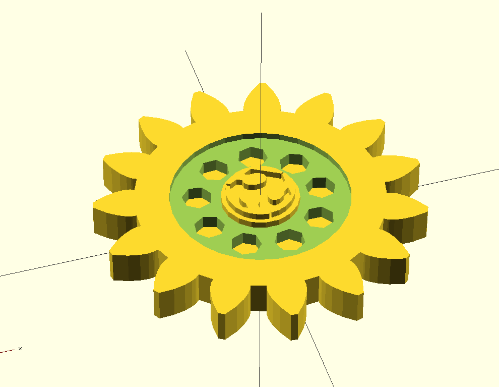
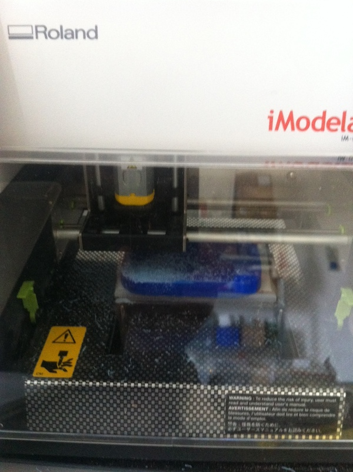

Molding and casting
-------------------

This week's assignment is to design a 3D mold, machine it, and cast parts from it. 

I just opened my FabLab in Cascina, and in the town a famous chocolate factory has its headquarters. So I assumed that using some local produce for my weekly assigment could be also interesting for showing this fabrication technique to people coming at the lab.

My idea was to machine a gear-shaped mold, adding a FabLab logo on top of it.

The 3D Model I designed for the mold comes straight from the MCAD library found in OpenSCAD. I added some solid fill in the middle and positioned an extruded FabLab logo on top of it starting from an "OpenSCAD" DXF version produced by Inkscape using the great [Inkscape-OpenSCAD-DXF-Export](https://github.com/brad/Inkscape-OpenSCAD-DXF-Export) extension.

This is how the initial model looks like:

In order to produce the mold, I initially planned to use the MDX-15 in the lab, but the machine had been used for producing PCBs and it needed to be neatly cleaned before starting to mill wax.

Furthermore, having experienced during the last week how tedious can be milling PCBs with the iModela, I needed to find another use for this small machine. Looking on the Internet I found it could be used for wax and with good results. Also the 1.5mm bit coming with it would be good enough for producing a small mold, suitable for chocolate.

The only bad news is that the iModela needs a Windows application call iModela Player to produce 3D objects, so I needed to learn a new software.

Overall the Modela Player looks very professional, it has lots of options and best of all it provides ready-to-use presets for many different bits, included the one I have for the iModela. It takes an STL file and allows to define different "passes" for roughing up the model first and then detailing it incrementally.

    TODO put Model Player screenshot

The OpenSCAD STL file opened in Modela Player without any issue, and I was able to configure one roughing pass and two fine detail passes without much trable.

The first challenge came from the fact that wax blocks I received from Roland did not fit the iModela bed. I then decided to melt one into a more compact block using a metal box. The only way for heating wax in the lab is the hot air gun from the soldering station. And it took a whole hour to complete the process, from scraping the wax off the block, to melting it and let it cool down for machining. 

The resulting block was not very precise and it had weak corners. I didn't realize this was a problem till after several minutes milling it, when the machine, or the program, totally ignored my XY axis zeroed far away from the corner, and started milling from the machine zero.

Milling took forever, more than half day, with the machine refining over and over the same surfaces, just removing very little material at every pass. The only positive thing is that the Modela Player, understanding the bit was the same for all passes, batched the whole milling in a single "process" without interruptions.

The result, even if the corner is not completely close, and needs some refinement by hand, looks very precise and I believe is impressive for the kind of machine that did it. Possibly, using a more precise bit in the last pass could have produced an even more detailed result, as some users in the Roland forum show.

** to be continued **

Files
-----

OpenSCAD Model [chocogear.scad](../files/week09/chocogear.scad) [fablogo.dxf](../files/week09/fablogo.dxf)
STL Model [chocogear.stl](../files/week09/chocogear.stl) 

