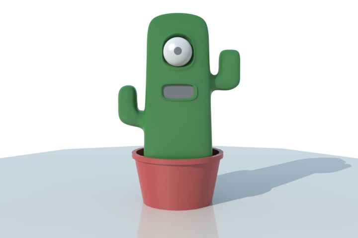

<ul class="breadcrumbs">
	<li><a href="../index.html">Home</a></li>
	<li class="current"><a href="./index.html">Final project</a></li>
</ul>

# Final Project

### A digital companion platform

My project proposal is about building a programmable digital companion, powered by open hardware and software. I hope this could be the basis of the democratic diffusion of such objects, or at least of raising the awareness of the idea of interacting with computers using different means.

<ul class="inline-list">
    <li><a href="./description.html" class="button medium">Project description</a></li>
    <li><a href="./gantt.html" class="button medium">Schedule</a></li>
    <li><a href="./log.html" class="button medium">Activity Log</a></li>
</ul>
