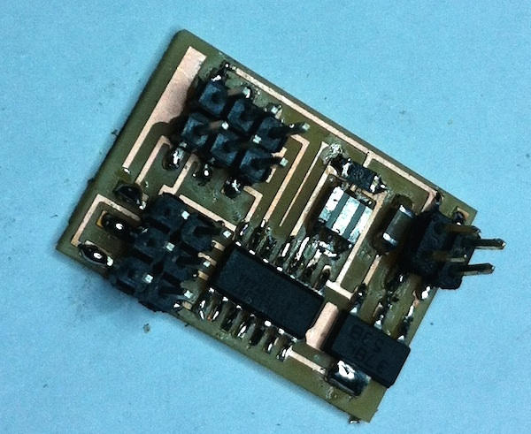
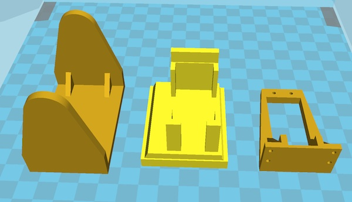
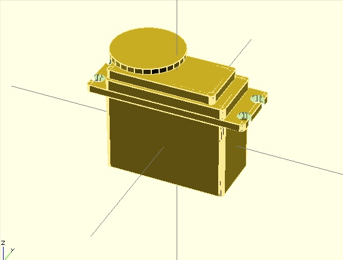
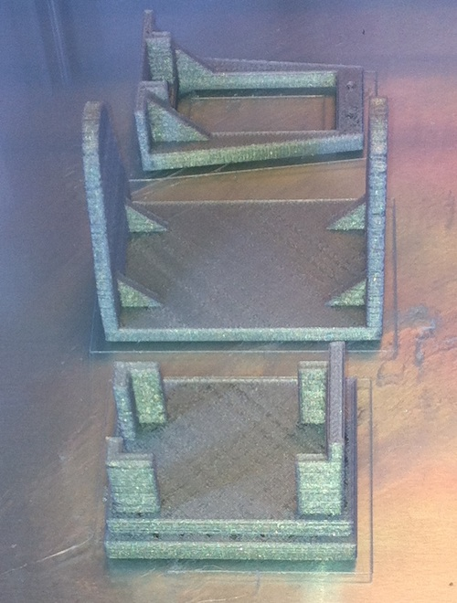
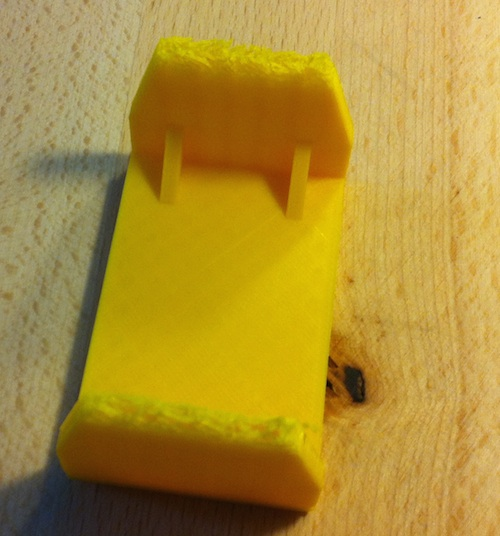
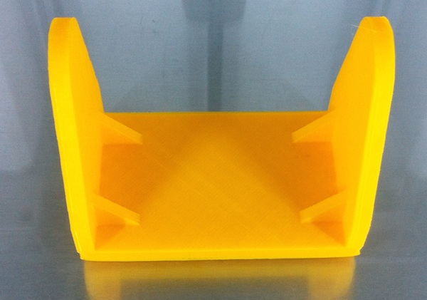

<ul class="breadcrumbs">
	<li><a href="../index.html">Home</a></li>
	<li><a href="./index.html">Final project</a></li>
	<li class="current"><a href="./log.html">Activity log</a></li>
</ul>

#Activity Log

21 March 2014

Progress on the project has slowed down, as I encountered a significant bottleneck on the serial camera throughput.

I tested the camera on an Arduino Leonardo using the code provided by [Sparkfun](https://www.sparkfun.com/products/retired/10061).

The result was quite poor in terms of frames per second, as I could take a picture in just 6 seconds! This result is not really useful
for my project goals, as I was planning to offer the possibility to use the companion video for computer vision, web conferencing and 
other mundane tasks.

The final conclusion is that while keeping the original architecture for my project, I will turn to more powerful hardware as the main
controller board. I'm currently looking for alternatives such as the Raspberry PI or Arduino YUN to achieve this goal.

Also, I think that switching to such kind of board will significantly reduce the cost of the overall solution, as a very cheap USB camera
would be now usable. I'll write more as I weight the different possibilities.

4 March 2014
 
I completed the Servo control board and programmed it with the two Channel software PWM. I could finally move one and try it with actual servo motors to see if it worked.

In order to have a working rig for actually moving the camera, I started from an existing set of models downloaded by Thingiverse which I planned to print using the Ultimaker 2.

    
Additionally, to test if the models were suitable for my HS-311 servo, I designed a model in OpenSCAD to match my motor specs. The model source is also available on [github](https://github.com/fibasile/HS-311-OpenSCAD).

The actual 3D printing of these models was not straightforward. Due to some lower quality PLA material, the initial versions of the printed object where not suitable for use. The filament was not sticking well and also skipping significantly while extruded. The print itself required several hours so I was very disappointed by the result:

    
In order to achieve a better result, I tried printing again one of the parts with a different filament and raising the temperature to 230 degrees. This time the printed part looked far more solid, but unfortunately the printer stopped extruding at some point, resulting in the following:

Finally I was able to produce the parts, achieving a better quality by slowing much the printing process to around 50% speed, and by rising temperature to 235 degrees. Most of the parts came out good enough for use, except one of the two bits holding the camera. In order not to monopolize the lab's printer I decided to put some tape to make parts stronger without printing them again.

The assembled pan-tilt movement still needs few tweaks for being ready to be used for my project, but the initial result looks promising:

<iframe width="640" height="360" style="width: 100%" src="//www.youtube.com/embed/lYbz5wtTXzw" frameborder="0" allowfullscreen></iframe>
 

25 Feb 2014
 
I'm still working on completing the Servo control board, for which I had some trouble in finding the right components and soldering the connector pins.
I did anyway experiment with several designs for the pan-tilt movement, which I plan to build using the 3D printer during the upcoming week.

For the camera module I dediced to use a <a href="http://linksprite.com/wiki/index.php5?title=JPEG_Color_Camera_Serial_UART_Interface_(TTL_level)">Linksprite Serial Jpeg Camera</a>.
This module will allow to grab picture frames directly encoded in JPEG format at several resolutions. I will be able to transfer such frames to a temporary storage and then get them accessible to the main PC control unit of the digital companion.

I investigated other possibilities, such as using directly a Toshiba Camera module such as the [TCM8240MD](http://www.toshiba.com/taec/components/docs/ProdBrief/05B02_TCM8240MD.pdf), but as far as I understood this module can't be controlled by any 8bit AVR controller, and even encoding JPEG frames would require an ARM processor or a dedicated DSP unity.  

18 Feb 2014
 
I've identified most of the components I will be using for the first version of the project. During the upcoming week I will start creating the movement mechanism for the digital companion eye, using two servo motors and an ATTiny44 processor. As agreed with my instructor milling and stuffing the control board will be part of my next week assignment, and I plan to have this component of the project completed by next week.

10 Feb 2014
 
Started researching components needed for the electronic part of the project. I decided to start assembling a first version of the project using ready-made electronic components, and do a basic software interface to control them via serial link. I will be then replacing each module with a self-fabricated one.

30 Jan 2014
 
Defined the basic project concept and made initial 3d models for the case. 
Setup the project milestones and Trello in order to track progress.

11 Feb 2014
 
Created [logo](../images/week02/logo.png) and defined name for the project: "PACO". Created a more detailed 3D model for the project case.

